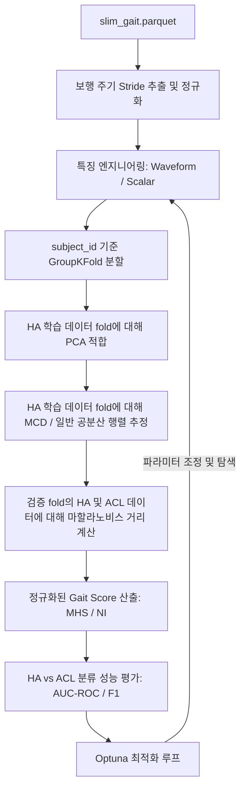

# 01_plan.md — ACL 평가를 위한 마할라노비스 거리 기반 보행 점수화 기획서

이 문서는 `slim_gait.parquet` 데이터를 사용하여 정상인 대조군(HA)과 ACL 손상군(ACLD/ACLR) 간의 마할라노비스 거리를 계산하는 상세 실행 계획을 설명합니다. 제공된 두 편의 논문 개념을 통합하고, Optuna를 활용하여 하이퍼파라미터 및 파이프라인 최적화를 수행합니다.

---

## 1. 목표 (Goal)
차원 축소된 관절 각도 공간에서 정상 대조군(HA) 대비 ACL 손상군(ACLD/ACLR)의 마할라노비스 거리를 계산하고, Optuna를 통해 특징 선택, 데이터 스케일링, 공분산 추정 등 파이프라인 전반을 최적화하여 정상과 환자를 분류하는 모델의 성능(AUC-ROC 및 F1-Score)을 극대화합니다. 모든 과정과 결과는 샌드박스 내부에 상세히 기록합니다.

---

## 2. 이론적 배경 및 아키텍처 (Background & Architecture)

참조 논문에 기반한 핵심 설계 요소:
1. **Lewko (2024)**: *Motion Healthiness Score (MHS)* 제안:
   - PCA를 통한 차원 축소 (Guttman-Kaiser criterion, 고유값 $\ge 1$인 주성분만 유지).
   - 정상 대조군 분포에 대해 **Robust MCD (Minimum Covariance Determinant)** 방법(support fraction = 0.75)을 사용하여 공분산 행렬을 추정, 아웃라이어 영향 배제.
   - 마할라노비스 거리 값을 카이제곱 분포의 95% 분위수(정상 임계값 $t_h$)와 환자군 KDE 분포의 95% 분위수(비정상 임계값 $t_s$)를 경계로 삼아 0~10점 사이의 점수로 Piecewise Linear Interpolation 변환.
2. **Liu et al. (2020)**: *Normalcy Index (NI)* 구현:
   - 대조군의 평균 및 표준편차를 기준으로 전체 변수 표준화.
   - PCA 수행 후, 각 주성분 점수를 해당 고유값의 제곱근(표준편차)으로 나누어 스케일링.
   - 스케일링된 주성분 점수들의 제곱합 $d$ 계산. (수학적으로 원래 공간에서의 마할라노비스 거리 제곱 $D_M^2$과 완전히 동일함).

### 제안하는 파이프라인 아키텍처



---

## 3. 구현 단계 (Implementation Steps)

샌드박스 폴더는 상위 `Walking/` 디렉토리 하위에 `0702_Mahalanobis/`로 생성하여 다음과 같이 구조화합니다.

```
Walking/
└── 0702_Mahalanobis/
    ├── 01_plan.md                         # 본 기획안 (한국어)
    ├── scripts/
    │   ├── 01_data_preprocessing.py       # Stride 분할, Trim, 101pt 보간 및 피처 추출
    │   ├── 02_mahalanobis_pipeline.py     # PCA, MCD 공분산, 마할라노비스 거리 및 MHS/NI 계산
    │   └── 03_optuna_optimization.py      # Optuna 기반 파이프라인 하이퍼파라미터 최적화
    └── results/
        ├── 01_optuna_best_params.json     # 최적화 탐색 결과 요약
        └── 02_evaluation_report.md        # 교차 검증 결과 요약 보고서
```

### 1단계: 데이터 전처리 (`01_data_preprocessing.py`)
- `/Users/ryutt/Desktop/mini_ryutt/Walking/data/processed/slim_gait.parquet` 로드.
- 좌/우측 발 접촉 신호(`footContacts_0`, `footContacts_2`)의 heel strike 시점을 검출하여 Stride 분할.
- 가속/감속 구간의 영향을 최소화하기 위해 각 Trial별 앞/뒤 2 strides 제거 (Trim).
- 9개 관절 각도 데이터를 Stride당 101 포인트로 선형 보간하여 정규화.
- Optuna 탐색을 위해 두 종류의 특징 벡터 세트 생성:
  1. **Waveform 특징**: 관절별 파형 데이터를 이어 붙인 고차원 벡터 (9개 관절 $\times$ 101 = 909차원).
  2. **Scalar 특징**: 관절별 가동범위(ROM), 피크 각도, stance/swing 시간 비중 등 요약 지표 (약 30~50차원).

### 2단계: 공분산 및 마할라노비스 거리 파이프라인 (`02_mahalanobis_pipeline.py`)
- 피험자 기준의 데이터 누수 방지를 위해 `GroupKFold(n_splits=5)`(subject_id 기준) 적용.
- 각 fold에서:
  1. 학습 세트의 정상 대조군(HA) 데이터만을 사용하여 스케일러(StandardScaler 등) 및 PCA 적합.
  2. Kaiser criterion 또는 지정 비율을 기준으로 주요 주성분(PC) 개수 $k$ 선정.
  3. 학습 세트 HA의 PC Score 분포에 대해 평균 $m$과 공분산 $C$(또는 Robust MCD 공분산 $C_{MCD}$) 추정.
  4. 검증 세트의 HA 및 ACL 데이터를 주성분 공간으로 투영 후 마할라노비스 거리 계산.
  5. 거리를 MHS 또는 NI 점수로 변환.
- 전체 Fold의 OOF(Out-of-Fold) 예측치에 대해 HA vs ACL 분류 성능(AUC-ROC) 평가.

### 3단계: Optuna 최적화 (`03_optuna_optimization.py`)
Optuna 최적화 탐색 공간:
- `feature_type`: `["waveform", "scalar"]`
- `scaling`: `["zscore", "robust", "minmax"]`
- `pca_k_method`: `["kaiser", "variance_ratio", "fixed"]`
- `pca_variance_ratio` (variance_ratio 사용 시): $0.70 \sim 0.99$
- `pca_fixed_k` (fixed 사용 시): $2 \sim 50$
- `use_mcd`: `[True, False]`
- `mcd_support_fraction`: $0.50 \sim 0.90$
- `joints_to_use`: 사용할 관절 조합 (9개 관절 각각의 활성화 여부)
- `speed_filter`: `["all", "normal", "fast", "slow"]`
- `distance_metric`: `["mahalanobis", "squared_mahalanobis"]`

**최적화 목적 함수**: Out-of-Fold 분류 AUC-ROC를 최대화.

---

## 4. 기록 및 검증 (Logging & Verification)
- 모든 Optuna trial 결과는 SQLite 파일(`optuna_mahalanobis.db`)에 기록 및 영구 보존.
- 최적의 하이퍼파라미터 및 최고 메트릭 정보를 `results/01_optuna_best_params.json`에 저장.
- MHS와 NI의 ACL 분류 변별력 비교 분석 결과를 `results/02_evaluation_report.md`에 자세히 기록.
