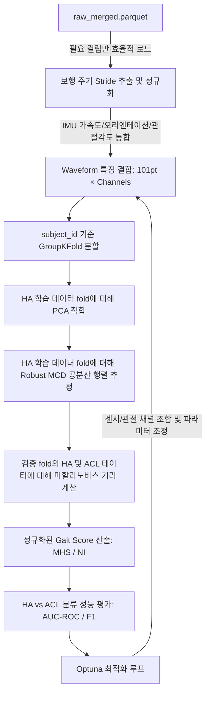

# 01_plan.md — IMU 센서 및 관절 각도 통합 마할라노비스 거리 기반 보행 점수화 기획서

이 문서는 `raw_merged.parquet` 데이터를 사용하여 실제 IMU 센서 원본 값(가속도, 오리엔테이션 등)과 관절 각도 데이터를 동기화 및 통합하고, 정상 대조군(HA) 대비 ACL 손상군(ACLD/ACLR)의 마할라노비스 거리를 계산하는 상세 실행 계획을 설명합니다. 제공된 두 편의 논문 개념을 통합하고, Optuna를 활용하여 하이퍼파라미터 및 파이프라인 최적화를 수행합니다.

---

## 1. 목표 (Goal)
`raw_merged.parquet`에서 추출한 실제 IMU 센서 원본 데이터(가속도, 오리엔테이션 등)와 Xsens 추정 관절 각도 데이터를 보행 주기(Stride)별로 분할하고 101 포인트로 정규화한 후, PCA를 통해 차원 축소를 수행합니다. 정상인(HA) 분포에 기반한 Robust MCD 마할라노비스 거리 공간을 구축하고, Optuna 최적화를 통해 정상과 ACL 환자군을 가장 잘 분류(AUC-ROC 극대화)하는 입력 변수 조합 및 파이프라인 하이퍼파라미터를 결정합니다.

---

## 2. 이론적 배경 및 아키텍처 (Background & Architecture)

참조 논문에 기반한 핵심 설계 요소:
1. **Lewko (2024)**: *Motion Healthiness Score (MHS)* 제안:
   - PCA를 통한 차원 축소 (Guttman-Kaiser criterion, 고유값 $\ge 1$인 주성분만 유지).
   - 정상 대조군 분포에 대해 **Robust MCD (Minimum Covariance Determinant)** 방법(support fraction = 0.75)을 사용하여 공분산 행렬을 추정, 아웃라이어 영향 배제.
   - 마할라노비스 거리 값을 카이제곱 분포의 95% 분위수(정상 임계값 $t_h$)와 환자군 KDE 분포의 95% 분위수(비정상 임계값 $t_s$)를 경계로 삼아 0~10점 사이의 점수로 Piecewise Linear Interpolation 변환.
2. **Liu et al. (2020)**: *Normalcy Index (NI)* 구현:
   - 대조군의 평균 및 표준편차를 기준으로 전체 변수 표준화.
   - PCA 수행 후, 각 주성분 점수를 해당 고유값의 제곱근(표준편차)으로 나누어 스케일링.
   - 스케일링된 주성분 점수들의 제곱합 $d$ 계산. (수학적으로 원래 공간에서의 마할라노비스 거리 제곱 $D_M^2$과 완전히 동일함).

### 제안하는 파이프라인 아키텍처



---

## 3. 구현 단계 (Implementation Steps)

샌드박스 폴더는 상위 `Walking/` 디렉토리 하위에 `0702_Mahalanobis/`로 생성하여 다음과 같이 구조화합니다.

```
Walking/
└── 0702_Mahalanobis/
    ├── 01_plan.md                         # 본 기획안 (한국어)
    ├── scripts/
    │   ├── 00_extract_subset.py           # raw_merged.parquet에서 핵심 변수만 추출하여 subset parquet 생성
    │   ├── 01_data_preprocessing.py       # Stride 분할, Trim, 101pt 보간 및 피처 추출
    │   ├── 02_mahalanobis_pipeline.py     # PCA, MCD 공분산, 마할라노비스 거리 및 MHS/NI 계산
    │   └── 03_optuna_optimization.py      # Optuna 기반 파이프라인 하이퍼파라미터 최적화
    └── results/
        ├── 01_optuna_best_params.json     # 최적화 탐색 결과 요약
        └── 02_evaluation_report.md        # 교차 검증 결과 요약 보고서
```

### 0단계: 데이터 서브셋 추출 (`00_extract_subset.py`)
- `raw_merged.parquet` (6.29 GB)에서 분석에 사용할 필수 컬럼들만 선별하여 별도의 경량화 파일인 `data/processed/raw_subset_mahalanobis.parquet` (약 200MB 수준)으로 1회성 추출을 수행합니다.
- 추출할 컬럼 목록:
  - 메타: `subject_id`, `group`, `speed`, `file_name`, `time_ms`
  - 발 접촉: `footContacts_0`, `footContacts_1`, `footContacts_2`, `footContacts_3`
  - IMU 원본: `sensorFreeAcceleration_0~20`, `sensorOrientation_0~27`, `sensorMagneticField_0~20`
  - 관절 각도: `jointAngle_42~62` (18개 컬럼)

### 1단계: 데이터 전처리 (`01_data_preprocessing.py`)
- 생성된 경량 `raw_subset_mahalanobis.parquet` 로드. (6GB 전체 로딩이 불필요하여 학습 및 최적화가 비약적으로 빨라집니다.)
- 좌/우측 발 접촉 신호(`footContacts_0`, `footContacts_2`)의 heel strike 시점을 검출하여 Stride 분할 (Heel Strike는 신호가 0에서 1로 상승 전이되는 시점으로 감지).
- 가속/감속 구간의 영향을 최소화하기 위해 각 Trial별 앞/뒤 2 strides 제거 (Trim).
- 선택된 IMU 센서 원본 채널들과 관절 각도 채널의 데이터를 Stride당 101 포인트로 선형 보간하여 정규화.
- 최종 특징 벡터:
  - 101pt Waveform 특징 벡터: (선택된 IMU 및 관절 채널 수 $\times$ 101) 차원의 1D 벡터 생성.

### 2단계: 공분산 및 마할라노비스 거리 파이프라인 (`02_mahalanobis_pipeline.py`)
- 피험자 기준의 데이터 누수 방지를 위해 `GroupKFold(n_splits=5)`(subject_id 기준) 적용.
- 각 fold에서:
  1. 학습 세트의 정상 대조군(HA) 데이터만을 사용하여 스케일러(StandardScaler 등) 및 PCA 적합.
  2. Kaiser criterion 또는 지정 비율을 기준으로 주요 주성분(PC) 개수 $k$ 선정.
  3. 학습 세트 HA의 PC Score 분포에 대해 **Robust MCD(Minimum Covariance Determinant) 방식으로 공분산 행렬 및 평균을 추정**합니다. 센서 노이즈와 보행 특이치(Outlier)에 대한 강건성을 보장하기 위해 **support fraction은 0.75로 고정**하여 사용합니다. (일반 공분산은 노이즈에 매우 취약하므로 배제합니다.)
  4. 검증 세트의 HA 및 ACL 데이터를 주성분 공간으로 투영 후 마할라노비스 거리 계산.
  5. 거리를 MHS 또는 NI 점수로 변환.
- 전체 Fold의 OOF(Out-of-Fold) 예측치에 대해 HA vs ACL 분류 성능(AUC-ROC) 평가.

### 3단계: Optuna 최적화 (`03_optuna_optimization.py`)
Optuna 최적화 탐색 공간:
- **입력 데이터 채널 조합 최적화**:
  - `use_acceleration`: 가속도 센서 데이터(`sensorFreeAcceleration`) 포함 여부 `[True, False]`
  - `use_orientation`: 오리엔테이션 센서 데이터(`sensorOrientation`) 포함 여부 `[True, False]`
  - `use_joint_angles`: 관절 각도 데이터(`jointAngle`) 포함 여부 `[True, False]`
  - `joints_subset`: 관절 각도 사용 시 9개 관절 조합 필터링 (각 관절의 활성화 여부)
- **파이프라인 하이퍼파라미터 최적화**:
  - `scaling`: `["zscore", "robust", "minmax"]`
  - `pca_k_method`: `["kaiser", "variance_ratio", "fixed"]`
  - `pca_variance_ratio` (variance_ratio 사용 시): $0.70 \sim 0.99$
  - `pca_fixed_k` (fixed 사용 시): $2 \sim 100$
  - `speed_filter`: `["all", "normal", "fast", "slow"]`
  - `distance_metric`: `["mahalanobis", "squared_mahalanobis"]`

**최적화 목적 함수**: 통합 Waveform 입력에 대해 Robust MCD (support fraction = 0.75) 기반 마할라노비스 거리를 사용한 Out-of-Fold 분류 AUC-ROC를 최대화.

---

## 4. 기록 및 검증 (Logging & Verification)
- 모든 Optuna trial 결과는 SQLite 파일(`optuna_mahalanobis.db`)에 기록 및 영구 보존.
- 최적의 하이퍼파라미터 및 최고 메트릭 정보를 `results/01_optuna_best_params.json`에 저장.
- MHS와 NI의 ACL 분류 변별력 비교 분석 결과를 `results/02_evaluation_report.md`에 자세히 기록.
