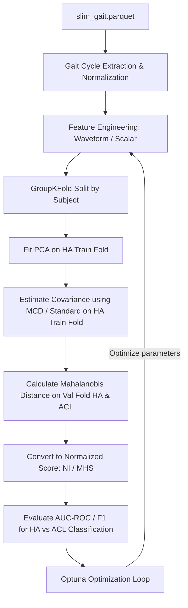

# 01_plan.md — Mahalanobis Distance Gait Scoring for ACL Assessment

This document outlines the detailed execution plan for calculating the Mahalanobis distance between healthy controls (HA) and ACL injury groups (ACLD/ACLR) using the `slim_gait.parquet` dataset. The design integrates concepts from the provided literature and leverages Optuna for hyperparameter optimization.

---

## 1. Goal
Evaluate and classify gait abnormalities of ACL groups (ACLD, ACLR) relative to Healthy Controls (HA) by measuring the Mahalanobis distance in a dimension-reduced kinematic/kinetic subspace, optimizing the feature selection and scoring pipeline using Optuna, and rigorously logging the results.

---

## 2. Theoretical Background & Architecture

Based on the referenced papers:
1. **Lewko (2024)**: Proposed the *Motion Healthiness Score (MHS)* using:
   - PCA for dimensionality reduction (Guttman-Kaiser criterion, eigenvalue $\ge 1$).
   - Robust Mahalanobis distance with Minimum Covariance Determinant (MCD, support fraction = 0.75) calculated against the healthy control subspace.
   - Mapping distance to a 0-10 score via a piecewise linear function bounded by the 95th percentile of the $\chi^2$ distribution (healthy threshold) and Kernel Density Estimation (KDE) of the stroke group (impaired threshold).
2. **Liu et al. (2020)**: Implemented the *Normalcy Index (NI)*:
   - Standardizing variables based on healthy group mean and standard deviation.
   - Applying PCA and scaling PC scores by the square root of eigenvalues.
   - Calculating the sum of squared standardized PC scores, which mathematically corresponds to the squared Mahalanobis distance.

### Proposed Architecture



---

## 3. Implementation Steps

We will structure the sandbox folder `0702_Mahalanobis/` inside `/Users/ryutt/Desktop/mini_ryutt/Walking/Study-review/` as follows:

```
0702_Mahalanobis/
├── 01_plan.md                         # Project plan
├── scripts/
│   ├── 01_data_preprocessing.py       # Segment & normalize cycles, extract features
│   ├── 02_mahalanobis_pipeline.py     # Calculate PCA, MCD, Mahalanobis, and MHS/NI
│   └── 03_optuna_optimization.py      # Run Optuna trials to maximize AUC-ROC / F1
└── results/
    ├── 01_optuna_best_params.json     # Optimization summary
    └── 02_evaluation_report.md        # Comprehensive report with figures
```

### Step 1: Data Preprocessing (`01_data_preprocessing.py`)
- Load `/Users/ryutt/Desktop/mini_ryutt/Walking/data/processed/slim_gait.parquet`.
- Detect gait cycles using heel strike contact signals (`footContacts_0` for Left, `footContacts_2` for Right).
- Trim first 2 and last 2 strides to remove accel/decel phases.
- Interpolate selected joint angles to 101 points per cycle.
- Produce two types of features for optimization:
  1. **Waveform Feature Vector**: Concat of joint waveforms (e.g. 9 joints $\times$ 101 points = 909 dimensions).
  2. **Scalar Feature Vector**: Joint range of motion (ROM), peak angles, stance/swing durations (approx 30-50 dimensions).

### Step 2: Covariance and Distance Calculation (`02_mahalanobis_pipeline.py`)
- Split subjects using `GroupKFold(n_splits=5)` on `subject_id` to prevent subject-level leakage.
- For each fold:
  1. Scale features (StandardScaler fit only on HA of the training fold).
  2. Apply PCA on HA train fold.
  3. Keep $k$ components based on the Kaiser criterion or a tuned threshold.
  4. Compute $m$ and $C$ (or $C_{MCD}$) of HA train fold PC scores.
  5. Project validation HA and ACL cycles onto the PC space.
  6. Compute squared Mahalanobis distance: $D_M^2 = (x - m)^T C^{-1} (x - m)$.
  7. Compute Gait Score (MHS/NI).
- Evaluate classification performance (AUC-ROC for HA vs ACL) using the OOF (Out-Of-Fold) predictions.

### Step 3: Optuna Optimization (`03_optuna_optimization.py`)
Search space for Optuna:
- `feature_type`: `["waveform", "scalar"]`
- `scaling`: `["zscore", "robust", "minmax"]`
- `pca_k_method`: `["kaiser", "variance_ratio", "fixed"]`
- `pca_variance_ratio` (if `variance_ratio`): $0.70 \sim 0.99$
- `pca_fixed_k` (if `fixed`): $2 \sim 50$
- `use_mcd`: `[True, False]`
- `mcd_support_fraction`: $0.50 \sim 0.90$
- `joints_to_use`: Subsets of `['hip_flexion', 'knee_flexion', 'ankle_dorsiflexion', ...]`
- `speed_filter`: `["all", "normal", "fast", "slow"]`
- `distance_metric`: `["mahalanobis", "squared_mahalanobis"]`

**Target Metric**: Maximize Out-of-Fold AUC-ROC or macro F1-score for HA vs ACL binary classification.

---

## 4. Verification & Logging
- Log all Optuna studies to a SQLite DB (`optuna_mahalanobis.db`).
- Save the optimization summary, best trial, and validation metrics to `results/01_optuna_best_params.json`.
- Write a detail summary report comparing the MHS/NI performance.
